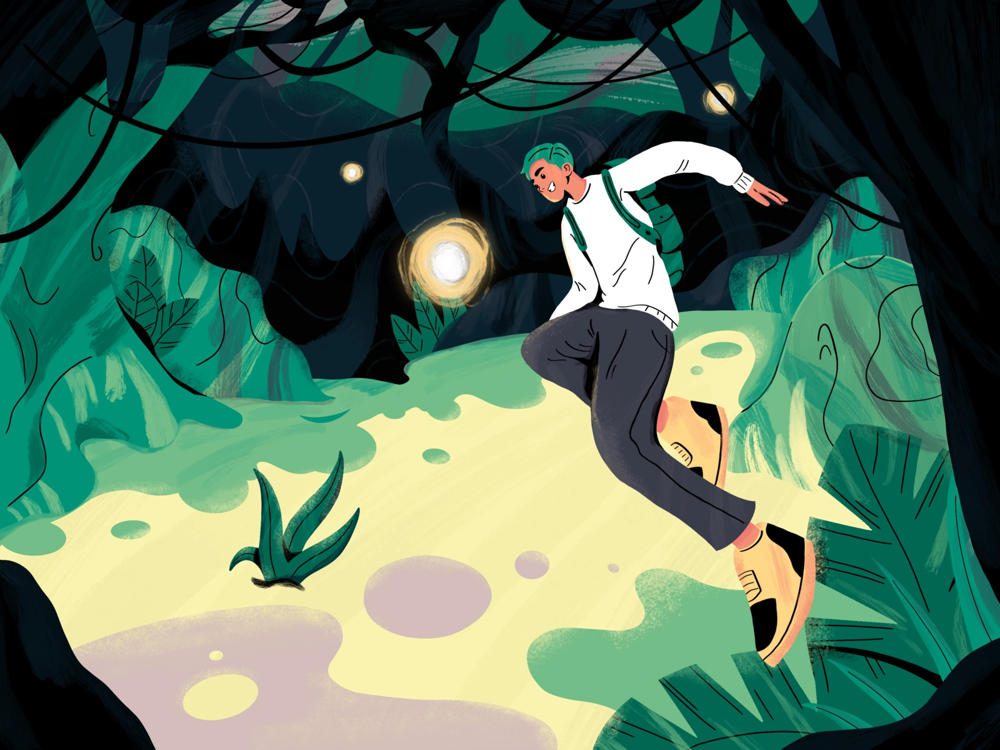

# Login page reveal animation with css

**Demo:** [Visit this link to see a live demo of the final result](https://dreamy-mcclintock-bad2d5.netlify.app/) \
In our website we will have 2 sections:

- A login section that has a form and validation function
- A website section that contains all the content of our webpage

> Note: The website section will have an img as background and content

```html
<div class="website" id="website">
  
  <div class="topnav">// Content here</div>
</div>
<div class="login" id="login"></div>
```

## Setting Login section to fullscreen on top

```css
.login {
  z-index: 2;
  position: fixed;
  top: 40%;
  transform: translateY(-50%);
  left: 30%;
  display: flex;
  flex-direction: column;
  justify-content: center;
  align-items: center;
}
```

## Masking content of the webpage and scaling the background

- To mask the content we add a circle clip-path to the webpage content and position it on top of the head of our character.
- We also add a smooth transition for the clip-path animation.

```css
.website {
  width: 100vw;
  height: 100vh;
  overflow: hidden;
  background-color: white;
  clip-path: circle(7% at 67% 38%);
  transition: all 2s ease-in-out;
}
```

- We set the img to be fullscreen and add the lowest z-index to it.
- We init the width of the img to be more than 100%

```css
.website img {
  width: 120%;
  transition: all 2s ease-in-out;
  z-index: 1;
}
```

## Revealing the content when login is valid

When the login is valid an 'active' class will be added to the website so we can manipulate the background animation and the clip-path, then the login section will be hidden.

```javascript
function submit() {
  document.getElementById("website").classList.add("active");
  // Add hiding animation to the login section
  $("#login").fadeOut();
}
```

```css
.website.active {
  clip-path: circle(90% at 56% 24%);
}
.website.active img {
  width: 100%;
}
```
